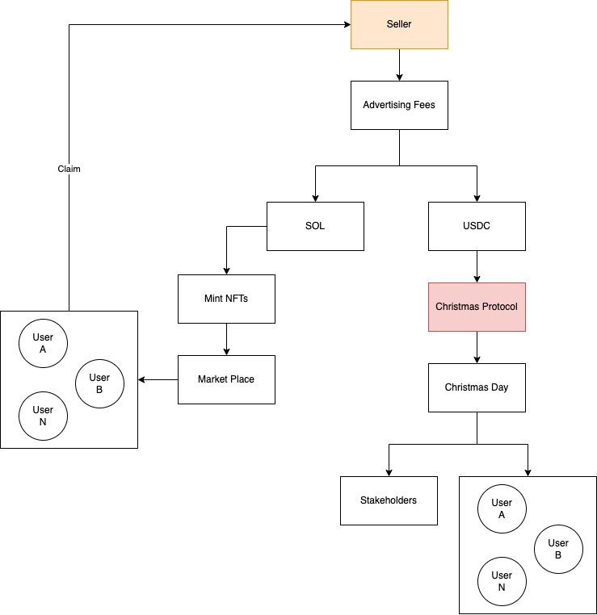

# Christmas Protocol

Christmas Protocol on Solana
### How it works

#### Overview


### Technical Info

#### Components
Our Program: christmas

#### Functions

1. mint_nft

caller: seller
account: Hash(christmas, seller_pubkey)

```
transaction(
    pay advertising fee,
    upload image + metadata stored in arweave (metaplex),
    program create a temporary account which owns this NFT (needs to store some lamports),
)
```

2. consume_nft

burn the nft

caller: buyer

```
transaction(
    buyer with the nft check with seller QR code that it matched,
    burn the nft
)
```

### Setup Solana Localnet

_Helpful Commands_

```bash
solana config get  # get current solana config
solana-keygen pubkey ./id_local.json  # get public key of a private key
```

_Run local solana validator_

```bash
solana-test-validator  # [--quiet]
```

_Generate keypair_

```bash
solana-keygen new -o ./id_local.json
```

_Set solana config to local_

```bash
solana config set --url localhost --keypair /Users/benjaminhon/Developer/christmas/id_local.json
```

_Airdrop till you drop_

```bash
solana airdrop 1000
```

### Testing & Exploring on Local Validator

1. Go to [Solana Explorer](https://explorer.solana.com/)
2. Select Custom RPC URL (http://localhost:8899)
3. After Airdropping some solana, search for your pubkey in the explorer
