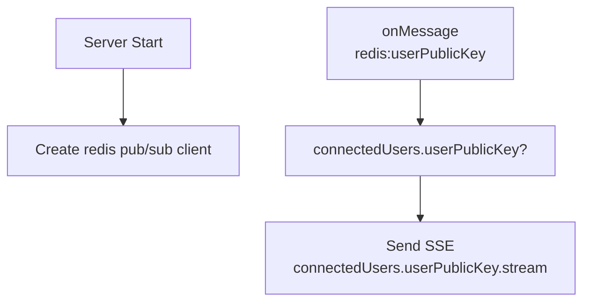
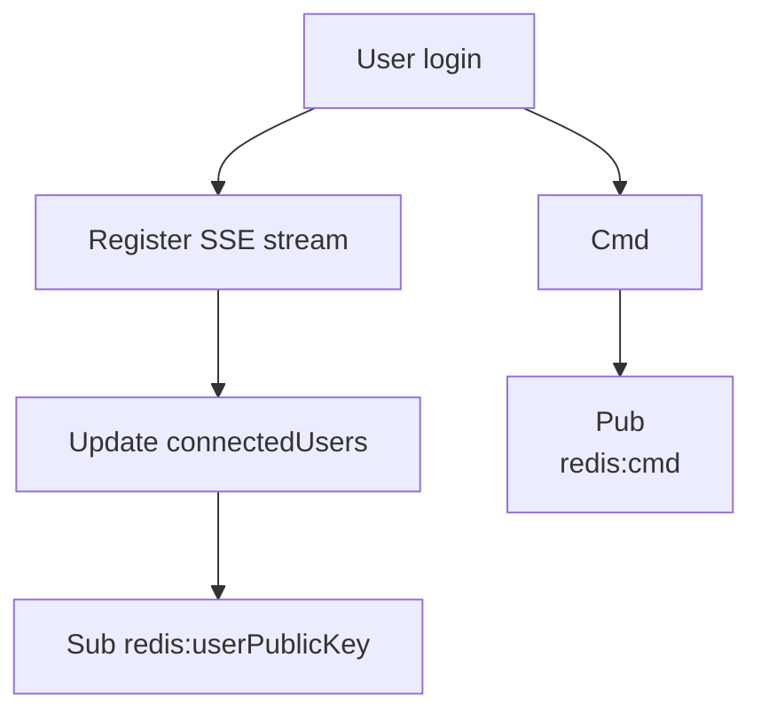
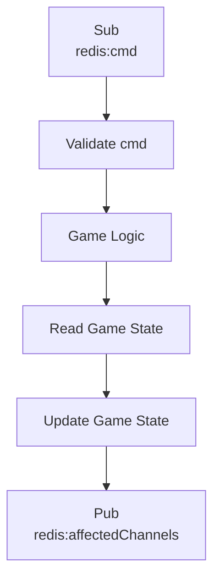

## Crossover

```typescript
interface ConnectedUser {
  publicKey: string;
  stream: ReadableStreamDefaultController<any>; // the SSE channel
}
let connectedUsers: Record<string, ConnectedUser> = {};
```

## Server Initialize



## User Initialize



## Game Worker



## Messages

The game worker publishes a subset of the updated game states which the client reads and updates it's own state. The client should calculate the difference between the game states and render any effects.

For example, the the player's HP changes from 100 to 80, the client can display a message "You wince in pain".

Depending on the message type, the client might behave differently. Eg. for chat messages it might perform a GET request for the last 10 messages

## Notes

`cmd:login` should also be a command so that the game logic may initialize the user's position if it is the first time he enters.

`cmd:login` should also load the user state from s3 into redis for speed.

`UpdateGameState` will update the game state in redis for speed.

Commands that change the user S3 metadata requires a transaction which changes the URI of the metadata in the Account, this requires a Signed Transaction. These include equiping, leveling up.

Potions and resources might be an NFT, but delegated to program to spend so that does not need to keep signing transactions
